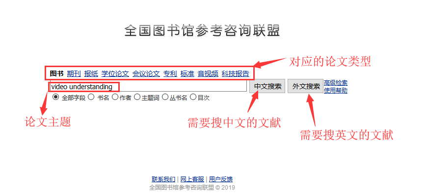

例如我想查找和下载视频理解(video understanding)相关论文   
大纲，蓝色都是有超级链接的可以直接打开:
## 第一步 [谷歌搜索(英文)](http://ac.scmor.com/) [学校的知网(中文)](https://www.cnki.net/)
## 第二步 下载论文([谷歌学术--英文](http://ac.scmor.com/) [学校的知网--中文](https://www.cnki.net/))下载不了看第三步
## 第三步 [sci-hub(论文下载)](http://sci-hub.tw/)下载不了看第四步
## 第四步 [图书馆联盟，文献传递(专利都可以发给你)](http://www.ucdrs.superlib.net/)
详细展开：
# 论文搜索和下载
## 1、在谷歌学术里搜索：
### http://ac.scmor.com

## 2、知网搜索，学校的知网服务或者你有自己的私人账号：
### https://www.cnki.net

## 3、sci-hub:
### http://sci-hub.tw

## 4、图书馆联盟-文献传递最快一会儿就发给你了，最晚第二天：
### http://www.ucdrs.superlib.net

